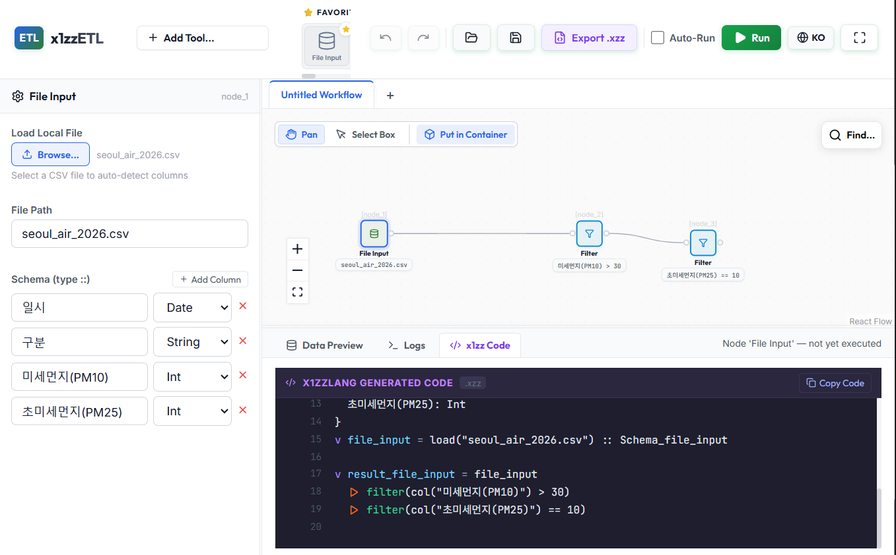

# x1zzLang Visual IDE

> **Visual pipeline builder for x1zzLang — design DAGs, generate .xzz, run native.**

A graphical IDE for visually designing data pipelines and generating/executing x1zzLang code. Build complex data transformation workflows by connecting nodes on a canvas — no code required.

---

## Screenshot

<!-- Add your screenshot here -->
<!--  -->

---

## Features

- **Visual Pipeline Builder** — Design DAG pipelines with drag-and-drop
- **Real-time x1zzLang Code Generation** — Automatically generates `.xzz` code as you connect nodes
- **9 Built-in Pipeline Operators** — File Input, Filter, Select, Group By, Count, Sort, Take, Drop Null, Fill Null
- **One-click Execution** — Send generated code to the backend and view results as a table
- **Workflow Management** — Tab-based multi-workflow, Undo/Redo, auto-save
- **Export `.xzz`** — Save your designed pipeline as a `.xzz` file
- **Container Grouping** — Group and minimize nodes with containers
- **Bilingual UI** — Korean / English support

---

## Architecture

```
x1zz-lang-visual-ide/
├── frontend/              # React + Vite frontend
│   ├── src/
│   │   ├── components/    # Canvas, ToolPalette, ConfigWindow, ResultsWindow
│   │   ├── transpiler/    # DAG → x1zzLang code transpilation engine
│   │   ├── locales/       # i18n translation files (ko, en)
│   │   └── App.jsx        # Main application entry
│   └── ...
└── ...
```

---

## Quick Start

```bash
cd frontend
npm install
npm run dev
```

Open your browser at `http://localhost:5173`.

---

## How It Works

1. **Build** — Drag nodes from the tool palette onto the canvas and connect them with edges
2. **Configure** — Set each node's parameters in the ConfigWindow
3. **Run** — Click the Run button to send the pipeline to the backend and view results

---

## Pipeline Operators

| Operator | Description |
|----------|-------------|
| **File Input** | Load CSV/Excel files with schema inference |
| **Filter** | Filter rows based on conditions |
| **Select** | Select specific columns |
| **Group By** | Group data and aggregate (count / sum / mean / min / max) |
| **Count** | Count the number of rows |
| **Sort** | Sort by column(s) |
| **Take** | Take the top N rows |
| **Drop Null** | Remove rows with null values |
| **Fill Null** | Fill null values with a specified value |

---

## Transpilation Pipeline

```
Visual DAG (nodes + edges)
        ↓
x1zzTranspiler (dagWalker)
        ↓
  .xzz source code
        ↓
  Backend /execute  (x1zzLang API)
        ↓
Results (table + logs)
```

---

## Tech Stack

| Layer | Technologies |
|-------|-------------|
| **Frontend** | React 18, Vite, @xyflow/react, i18next, Lucide React |
| **Backend** | x1zzLang engine (Rust + Polars) — connected via API |

---

## Related Projects

- [x1zzLang](https://github.com/ax1sofficially-alt/x1zzLang) — The x1zzLang compiler & runtime

---

## License

This project is licensed under the [Apache-2.0 License](./LICENSE).
